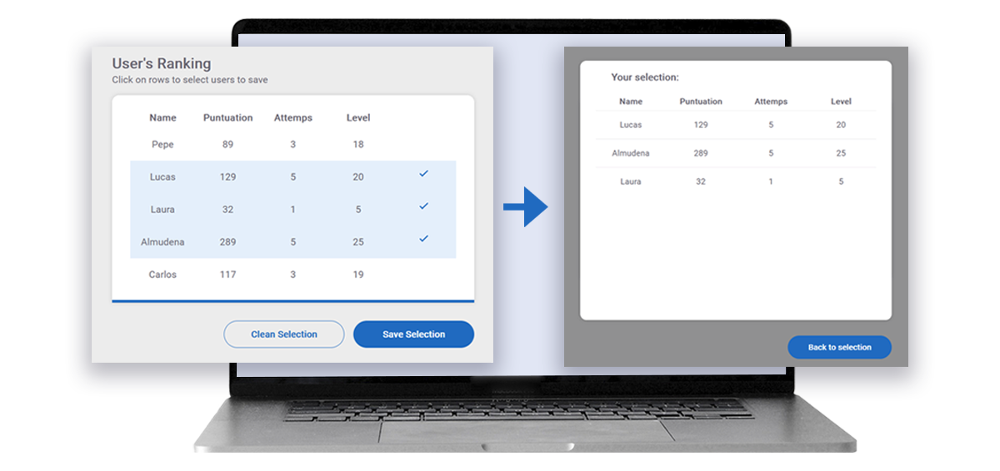

# Data Angular Table 📝
A simple way to select data from a table in Angular and send it to another component.  
For this challenge I have mocked up the data in a json in the assets directory.

➜ [Demo here](https://berryweb.netlify.app/home) 

---

---  

## 📂  What do you need to have installed on your computer?

➜ Angular: npm install -g @angular/cli

---
### 📚  This project use:

➜  Lazy loading modules  
➜  HttpClient    
➜  Models/Interfaces
➜  Pipes  
➜  @Input  
➜  @Output  

## ⚙️ Project Settings

To test locally you just need:  

➜ npm install

---
 🙋🏻‍♀️ [Abigail Ojeda Alonso](https://es.linkedin.com/in/abigail-ojeda)

